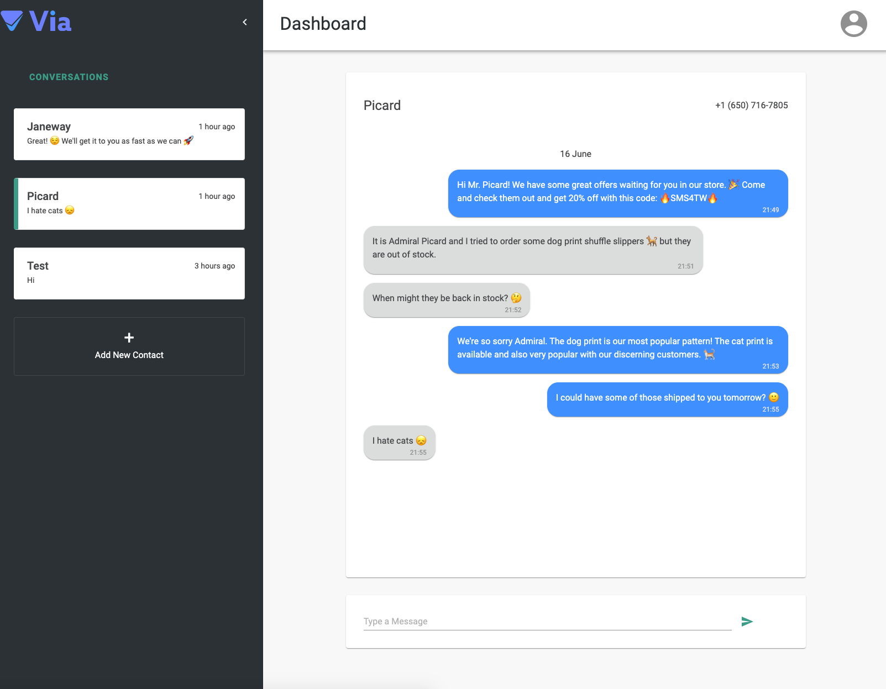

# Via Take Home Challenge - SMS Messaging App

This web app allows users to send and receive SMS messages. It uses Mongo, Express, React and Node. Features:

- Twilio API integration
- Realtime updates for new messages via socket.io
- Authentication of back-end routes using passport.js middleware and JWT cookies
- Authentication of socket connections using JWT cookies
- Material UI components and JSS styling
- Mobile responsive
- Add new contacts, contacts with new messages rise to the top in sidebar, screen auto scrolls down on new messages, date separators for messages on different days, new line preservation in messages, collapsible sidebar with smooth animation
- Emojis! 🙄

## Deployment

The app is deployed on Heroku at https://sms-chat-app.herokuapp.com/

## Installation & Local Startup

### Server

_Note: You will need a .env file in the root directory containing the Twilio and Mongo Cloud credentials_

In the root directory, run `npm install` and `npm run dev` to start the server in development mode on `http://localhost:3001`

### Client

In the `/client` directory run `npm install` and `npm start` to start the client in development mode on `http://localhost:3000`.

Visit `http://localhost:3000` in your browser to use the app.

_Note: `npm run build` builds the React app for production in the /build folder._

## Instructions

You can register a new user or click the `Demo` button on the login page to see an account with customers and messages.

You can add new numbers in the sidebar (_Note: because this is using a Twilio trial account, any new numbers need to also be added in the Twilio console by me and confirmed with an SMS code_)

In the Demo account you can send messages to the existing customers (Picard and Janeway) and the messages will come to me. If I see them I'll reply and you can see the sockets in action!

## What I'd do if I had more time

- Write tests
- Do better error handling and data checking (e.g. you can add invalid phone numbers)
- Add new unread message markers in the sidebar
- Handle multiple users having a customer with the same phone number
